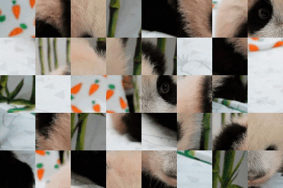

# Сортировки

Лаба: http://cs.mipt.ru/algo/lessons/sem_1/lab08.html

## Визуализации

нескольких методов сортировки на примере фотографии Катюши.

Один "тик" времени — одна перестановка элементов массива.

### Selection Sort

   

  <em>Пример сортировки выбором: "быстрая" версия (перестановка — "сразу" с минимальным).</em>

   

  <em>Пример сортировки выбором: более "честная" версия для визуального сравнения с другими методами сортировки (перестановка — каждый раз, когда находим элемент меньше текущего).</em>

### Insertion Sort

   

  <em>Пример сортировки вставками.</em>

### Bubble Sort

   

  <em>Пример сортировки пузырьком.</em>

### Cocktail Shaker Sort

   

  <em>Пример шейкерной сортировки.</em>

## Ссылки

### Катюша

* [Оригинал фото](https://caoinform.moscow/wp-content/uploads/sites/38/2024/01/030124-web-00005.jpg)
* [Ещё один (возможно, "более официальный") источник фото](https://www.mskagency.ru/materials/3349843)
